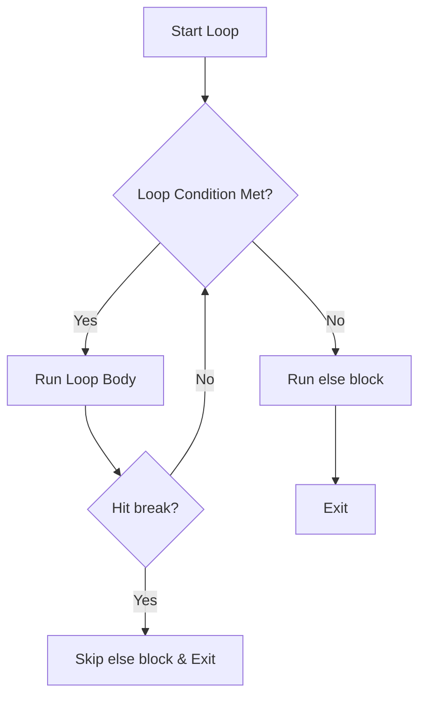

This document details program flow control, loops, range logic, and loop patterns.

---

## 1. Program Flow & Indentation Block Syntax

### 1.1 Indentation Blocks
Unlike languages that use curly braces `{}`, Python uses **4 spaces of indentation** to define code blocks:
```python
for i in range(1, 13):
    print(i)
    print("*" * 10)  # Both lines are in the loop block
```

### 1.2 The `pass` Keyword
Python blocks cannot be empty. If you need a placeholder block:
```python
if condition:
    # TODO: Implement later
    pass  # Prevents IndentationError
```

---

## 2. Loops, Ranges & Case-insensitive Matching

### 2.1 Range Customization
* **Forward**: `range(1, 10)` generates `1` through `9`.
* **Backward**: `range(10, 0, -2)` generates `10, 8, 6, 4, 2` (step is `-2`, `stop` is exclusive).

### 2.2 Case-insensitive Text Search (`casefold()`)
To search text regardless of case:
```python
# Converts input to lowercase. Better than .lower() for non-English letters.
if "cinema" not in activity.casefold():
    print("No cinema found")
```

### 2.3 Interactive Loop Design
Keep loop counters and calculations distinct. Use `break` to exit infinite loop constructs:
```python
guesses = 1
while True:
    guess = low + (high - low) // 2
    if high_low == "c":
        break
    guesses += 1
```

---

## 3. Advanced Loop Control: `for...else` & `while...else`

An `else` block can be attached to both `for` and `while` loops. It has a specific trigger condition:
* **Executes**: If the loop terminates **normally** (e.g., condition becomes `False` for `while`, or iterable is exhausted for `for`).
* **Skips (Does NOT execute)**: If the loop is terminated prematurely by a `break` statement.



### 3.1 Case A: Searching without flag variables (`for...else`)
In contrived.py:
```python
for number in numbers:
    if number % 8 == 0:
        print("Unacceptable value found")
        break
else:
    print("All numbers are acceptable")
```

### 3.2 Case B: Game Over / Early Exit (`while...else` in `adventure.py`)
In adventure.py:
* If the user enters `"quit"`, it hits `break` $\rightarrow$ skips the `else` block (prints `"Game over"` but NOT `"aren't you glad you got out of there"`).
* If the user enters a valid direction (e.g., `"north"`), the loop condition `chosen_exit not in available_exits` becomes `False` $\rightarrow$ loop terminates normally $\rightarrow$ enters `else` block (prints `"aren't you glad you got out of there"`).

```python
while chosen_exit not in available_exits:
    chosen_exit = input("Please choose a direction: ")
    if chosen_exit.casefold() == "quit":
        print("Game over")
        break
else:
    print("aren't you glad you got out of there")
```

### 3.3 Case C: Logical Deduction / Automatic Stop (`while...else` in `hilo.py`)
In hilo.py:
* **Guessing Correctly Middle of Loop**: The user inputs `"c"`. The loop executes `elif high_low == "c": print(...); break`. It prints the guess count and breaks. Because it breaks, the loop's outer `else` block is **skipped**.
* **Automatic Deduction**: The user narrows the range until `low == high`. The loop condition `low != high` becomes `False`. The loop terminates normally (without hitting `break`). Python automatically enters the `else` block, which deduces the final number and prints the guess count.

```python
while low != high:
    guess = low + (high - low) // 2
    # ... inputs and checks ...
    elif high_low == "c":
        print("I got it in {} guesses!".format(guesses))
        break  # Skips loop's else block
    guesses += 1
else:
    # Executes only if low == high (no break hit)
    print("You thought of the number {}".format(low))
    print("I got it in {} guesses".format(guesses))
```

> [!IMPORTANT]
> A common point of confusion is thinking that `guesses` cannot be printed if the `else` block is skipped. In `hilo.py`, the guess count is printed **inside the loop** (before `break`) for the mid-loop correct guess case, and **in the `else` block** for the automatic deduction case. The `else` block does not print for a mid-loop guess because it was bypassed by `break`.

---

## 4. Advanced Expression Chains (Data Cleaning)

We can chain generator expressions, ternary conditionals, and string methods:
```python
values = "".join(char if char not in separators else " " for char in number).split()
```
* **Execution Flow**:
  1. `for char in number`: Loop over each character.
  2. `char if char not in separators else " "`: Ternary condition replacing separators with space.
  3. `"".join(...)`: Joins all characters back into a string.
  4. `.split()`: Splits the string by whitespace into a list of number strings.

---

## 5. Safely Modifying Lists: Slices & Backward Loops

Modifying a list (such as deleting elements) while iterating forward over it is a very common source of logical bugs in Python.

### 5.1 The Bug: Modifying a List During Forward Iteration
When you delete elements from a list during a forward loop (like `for index, value in enumerate(data)`), the list shrinks, causing all subsequent items to shift down by one index. However, the loop counter continues to increment. This causes the loop to **skip the element immediately following a deletion**, leading to incomplete data filtering.

#### Incorrect Code:
```python
for index, value in enumerate(data):
    if (value < min_valid) or (value > max_valid):
        del data[index]  # Dangerous: index shifts skip the next element!
```

### 5.2 The Solution: Find Boundaries First, Delete Afterward
To safely modify lists, identify the indices (boundaries) of the slices you want to delete without changing the list size during the loop, then delete the slice in a single operation after the loop ends.

#### Correct Code (from outliers.py):
```python
# 1. Process low values (Forward iteration)
stop = 0
for index, value in enumerate(data):
    if value >= min_valid:
        stop = index
        break
del data[:stop]  # Single slice deletion after loop

# 2. Process high values (Backward iteration)
start = 0
for index in range(len(data) - 1, -1, -1):
    if data[index] <= max_valid:
        start = index + 1
        break
del data[start:]  # Single slice deletion after loop
```

### 5.3 Understanding the Backward Loop: `range(len(data) - 1, -1, -1)`
To find the high outlier boundary, we iterate from the end of the list to the beginning:
* **`start` = `len(data) - 1`**: Starts at the **last index** of the list (e.g. index 15 for a list of length 16).
* **`stop` = `-1`**: Since the `stop` value is exclusive, the loop stops before `-1` (i.e. at index `0`).
* **`step` = `-1`**: Decrements the index by 1 in each iteration (counting backwards).

The generated index sequence is: `15, 14, 13, ..., 1, 0`.

### 5.4 Concept Distinction: Index `-1` vs. Integer `-1`
It is crucial not to confuse the role of `-1` as a list index and as a range boundary:
1. **List Index `data[-1]`**: A Python syntax shortcut representing the **last element** of a list.
2. **Integer `-1` in `range()`**: A pure mathematical number representing the stop boundary of the range (exclusive). If the loop variable `index` ever took the value `-1`, accessing `data[index]` (which evaluates to `data[-1]`) would wrap around to access the last element of the list again, causing duplicate processing and bugs.

### 5.5 Safely Deleting In-Place via Backward Iteration
While deleting items during a **forward** loop causes subsequent items to shift left and be skipped, deleting items during a **backward** loop is **completely safe**.

#### Why It Works:
* When you delete an item at `index` in a backward loop, any subsequent elements (to the right, which have indices `> index`) still shift to the left.
* However, because the loop is moving backwards, the next index to be checked is `index - 1`.
* All elements to the left (indices `0` to `index - 1`) **do not change their indices** when an element to their right is deleted.
* Therefore, no items are skipped, and the loop safely visits every single element.

In gobackwards.py:
```python
# Safe in-place deletion while looping:
for index in range(len(data) - 1, -1, -1):
    if data[index] < min_valid or data[index] > max_valid:
        del data[index]  # Safe! Index shifts to the right of 'index' do not affect the next index to check.
```

> [!TIP]
> If you must modify/delete elements of a list in-place while iterating over it, **always iterate backwards**.

---

## 6. Boolean Aggregation: `all()` & `any()`

The built-in functions `all()` and `any()` evaluate an iterable and return a single **Boolean value (`True` or `False`)**. Both utilize **short-circuit evaluation** (early exit as soon as the result is determined).

* **`all(iterable)`**:
  * Returns `True` if **all** elements are truthy (or if the iterable is empty).
  * Immediately returns `False` upon encountering the first falsy element.
  * *Example*: `all(age >= 18 for age in [20, 25, 17, 30])` $\rightarrow$ `False` (stops at 17).
* **`any(iterable)`**:
  * Returns `True` if **at least one** element is truthy.
  * Immediately returns `True` upon encountering the first truthy element.
  * *Example*: `any(char.isupper() for char in "hello World")` $\rightarrow$ `True` (stops at 'W').

### 6.1 The Empty List Gotcha (空列表陷阱)
A common trap in Python is the behavior of these functions on an empty iterable:
* `all([])` returns `True` (**Vacuous Truth / 空虚真理**). Because there are no elements, there is no element that is `False` (i.e., we cannot find a falsy value to "disprove" the truth), so it defaults to `True`.
* `any([])` returns `False`. Because there are no elements, we cannot find a single `True` (truthy) value.

> [!WARNING]
> If you write `if all(entries):` expecting it to fail if `entries` is empty, it will **silently pass (evaluates to True)**.
> **The Defensive Pattern**: To safely check if all items in a potentially empty list are `True`, combine it with a non-empty check:
> ```python
> result = bool(entries) and all(entries)
> ```
> If `entries` is empty, `bool(entries)` evaluates to `False`, short-circuiting the expression and returning `False` without running `all(entries)`.

### 6.2 Container Truthiness (`bool`) vs. Value Truthiness (`any`)
* **`bool(container)`**: Evaluates the **container itself** (checks if it contains *any* items, regardless of what they are). Returns `True` if the container is non-empty, and `False` if it is empty.
* **`any(container)`**: Evaluates the **values inside the container** (checks if at least one value inside is truthy).
* **Comparison Example**:
  ```python
  data = [0, False, []]
  print(bool(data))  # Prints: True (because the list is not empty; it has 3 elements)
  print(any(data))   # Prints: False (because 0, False, and [] are all falsy values)
  ```

---

## 7. Programming Patterns: Sentinel Values & Loop Logic

### 7.1 Sentinel Values
A **sentinel value** is a special value in the context of a loop or algorithm that signals program termination.
* **Example**: In the guessing game, `0` is used as a sentinel value:
  ```python
  if guess == 0:
      break
  ```
  Since the answer is randomly chosen in the range $1 \le \text{answer} \le 1000$, `0` is outside the game's boundaries and serves as a clean way to let the player quit early.

### 7.2 Fibonacci Loop Logic & Unused Variables
In calculating the $n$-th Fibonacci number:
* **`range(n - 1)` Loop Iterations**: Since the base cases $F(0)$ and $F(1)$ are already set in two variables `n_minus2` and `n_minus1`, we only need $n - 1$ steps of addition and shifting to calculate $F(n)$.
* **Unused Loop Variable (`_`)**: In loops where the loop variable is not used inside the block, it is Pythonic convention to name the variable `_` (underscore). This indicates to both readers and linting tools that the variable is intentionally unused.
  ```python
  for _ in range(n - 1):
      # code that does not reference _
  ```
