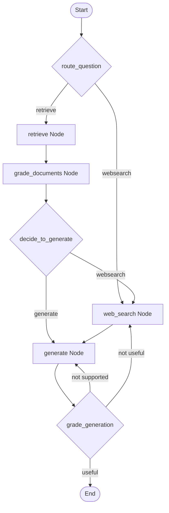
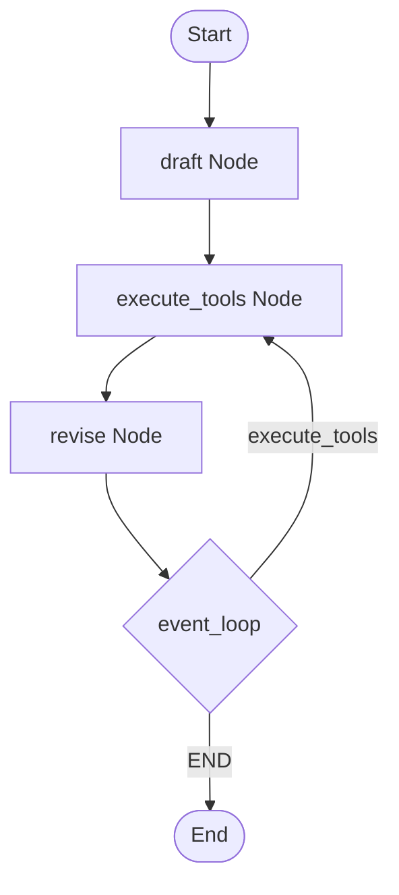

```mermaid
graph TD
    Start([Start]) --> Generate[generate Node]
    Generate --> ShouldContinue{should_continue}
    ShouldContinue -->|reflect| Reflect[reflect Node]
    Reflect --> Generate
    ShouldContinue -->|END| End([End])
```

This document provides a detailed technical comparison of the four distinct Agent architectures implemented in the branches of this repository:
1. **Agentic RAG (Corrective RAG - CRAG)** (`project/agentic-rag`)
2. **Basic Reflection Agent** (`project/reflection-agent`)
3. **Advanced Reflexion Agent** (`project/reflexion-agent`)
4. **ReAct Agent with Function Calling** (`project/ReAct-Agent-Function-Calling`)

---

## 1. Core Architectural Concepts

In transitioning from traditional LangChain pipelines to LangGraph, the codebase is structured around three main conceptual layers:

* **Chains (Low-Level Execution)**: The smallest units of work, composed of `PromptTemplate | LLM | OutputParser`. Chains execute a single request to the language model and parse the output into structured data or strings.
* **Nodes (Mid-Level Execution Steps)**: Python functions mapped to graph nodes. They act as bridges: extracting inputs from the shared state, invoking one or more chains or tools, and returning updates to the shared state.
* **Graph (High-Level Orchestration)**: A compiled `StateGraph` that binds nodes together with static edges and conditional edges (decision routers) to manage control flow, including loops and fallbacks.
* **State (Shared Memory)**: A central data schema (subclassing `TypedDict`) that stores all workflow context and messages. Each node returns updates which are merged into this state.

---

## 2. Detailed Branch Architectures

### Branch A: `project/agentic-rag` (Corrective RAG)

#### Goal
Implement an adaptive RAG system that active-checks document relevance, falls back to web search if the local database results are noisy or insufficient, and performs self-correction checks on the output (hallucination and query matching) before returning the answer.

#### Graph Flow


#### Key Components
1. **State Schema (`GraphState`)**:
   ```python
   class GraphState(TypedDict):
       question: str
       generation: str
       web_search: bool
       documents: List[Document]
   ```
2. **Chains**:
   - `retrieval_grader`: Evaluates if a single `Document` is relevant to the `question`. Outputs `GradeDocuments` with `binary_score: str` ("yes"/"no").
   - `generation_chain`: Standard RAG generator using the `rlm/rag-prompt` template from LangChain Hub. Outputs a raw response string.
   - `hallucination_grader`: Compares the generated answer to the retrieved `documents`. Outputs `GradeHallucinations` with `binary_score: bool`.
   - `answer_grader`: Evaluates if the generated answer addresses the `question`. Outputs `GradeAnswer` with `binary_score: bool`.
3. **Nodes**:
   - `retrieve`: Invokes the vector store retriever and writes the list of `Document`s to state.
   - `grade_documents`: Iterates over the retrieved documents, grades each, filters out irrelevant ones, and sets `state["web_search"] = True` if any document is graded as irrelevant.
   - `web_search`: Executes a Tavily web search, wraps the concatenated text in a standard `Document` wrapper, and appends it to the `documents` list.
   - `generate`: Runs the generator chain using the current documents and question.
4. **Conditional Edges**:
   - `route_question` (Entry point): Uses `question_router` to classify whether the query goes to `retrieve` or directly to `web_search`.
   - `decide_to_generate`: Evaluates `state["web_search"]`. Routes to `web_search` if `True`, otherwise directly to `generate`.
   - `grade_generation_grounded_in_documents_and_question`: 
     - Runs `hallucination_grader`. If it fails, loops back to `generate` ("not supported").
     - If it passes, runs `answer_grader`. If it passes, terminates ("useful"). If it fails, routes to `web_search` ("not useful") to fetch additional context.

---

### Branch B: `project/reflection-agent` (Basic Reflection)

#### Goal
Iteratively refine a draft response (e.g. a Twitter post) by having a generator node draft/rewrite the text, and a reflector node analyze the draft and provide constructive critique.

#### Graph Flow


#### Key Components
1. **State Schema (`MessageGraph`)**:
   ```python
   class MessageGraph(TypedDict):
       messages: Annotated[list[BaseMessage], add_messages]
   ```
2. **Chains**:
   - `generate_chain`: Prompts the model to act as a tech influencer writing the best possible post. If critiques are present in the conversation history, it revises the previous attempt.
   - `reflect_chain`: Prompts the model to act as a viral influencer grading the tweet, outputting detailed critique and recommendations.
3. **Nodes**:
   - `generation_node`: Invokes `generate_chain` with `state["messages"]` and appends the resulting AI message.
   - `reflection_node`: Invokes `reflect_chain` and appends the critique back to the list as a `HumanMessage` so the generator can read it as new instructions in the next round.
4. **Conditional Edges**:
   - `should_continue`: Checks the length of `state["messages"]`. If it exceeds 6 messages (3 rounds of generation & critique), it routes to `END`; otherwise, it routes to `reflect`.

---

### Branch C: `project/reflexion-agent` (Advanced Reflexion)

#### Goal
An advanced reflection agent that critiques its own answers and generates specific search queries, executes those queries using search tools, and leverages the new search findings to write a heavily cited and revised answer.

#### Graph Flow


#### Key Components
1. **State Schema**: Uses the prebuilt `MessagesState` schema.
2. **Pydantic Schemas**:
   - `AnswerQuestion`: Schema containing the `answer` (string), a `reflection` sub-object (critiques: `missing` and `superfluous`), and a list of `search_queries` to research.
   - `ReviseAnswer`: Inherits from `AnswerQuestion` and adds a list of `references` (motivating citations).
3. **Chains**:
   - `first_responder`: Binds `AnswerQuestion` as a tool call (`llm.bind_tools(tools=[AnswerQuestion], tool_choice="AnswerQuestion")`). The LLM must output its response using the structured format.
   - `revisor`: Binds `ReviseAnswer` as a tool call. Prompts the LLM to refine the draft using the new information fetched from search queries.
4. **Nodes**:
   - `draft_node`: Invokes `first_responder` to generate the initial answer, critiques, and queries.
   - `execute_tools`: A `ToolNode` that maps tool calls to a `run_queries` function. It executes the search queries in batch via the Tavily API and returns the search text as a `ToolMessage`.
   - `revise_node`: Invokes `revisor` to generate a new revised answer based on the full message history (which includes the draft, tool calls, and tool search results).
5. **Conditional Edges**:
   - `event_loop`: Counts the number of `ToolMessage` instances in the history. If it exceeds 2 (`MAX_ITERATIONS`), it routes to `END` to return the final answer; otherwise, it loops back to `execute_tools`.

---

## 3. Structural Comparison Matrix

| Dimension | Corrective RAG (CRAG) | Basic Reflection Agent | Advanced Reflexion Agent | ReAct Agent |
| :--- | :--- | :--- | :--- | :--- |
| **Primary Goal** | Verified knowledge retrieval & self-corrective Q&A | Iterative content drafting & styling refinement | Fact-checked drafting using research search loops | General task execution using dynamic tool calls |
| **State Type** | Custom `GraphState` (dict keys) | Custom `MessageGraph` (TypedDict) | Prebuilt `MessagesState` (message list) | Prebuilt `MessagesState` (message list) |
| **Self-Correction** | Yes (Hallucination & Answer graders) | Yes (Reflector feedback loops) | Yes (Self-critique & query loops) | No (Only tool loops) |
| **Tool Execution** | Fixed fallback (Web search node) | None | Dynamic (LLM defines query lists for Tavily) | Dynamic (LLM selects tool & parameters) |
| **Loop Trigger** | Condition Edge (Grader failures) | Count of messages in history | Count of `ToolMessage` objects in history | Presence of `tool_calls` in last message |
| **LLM Output Format** | Structured Pydantic scores | Raw string response | Structured Pydantic Tool Calls | Native Tool Call / Text |
