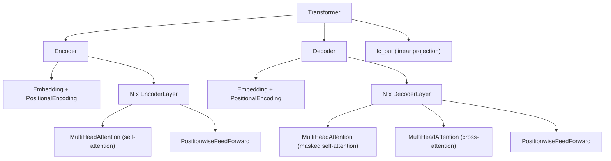
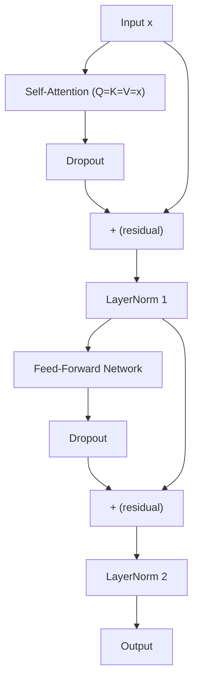
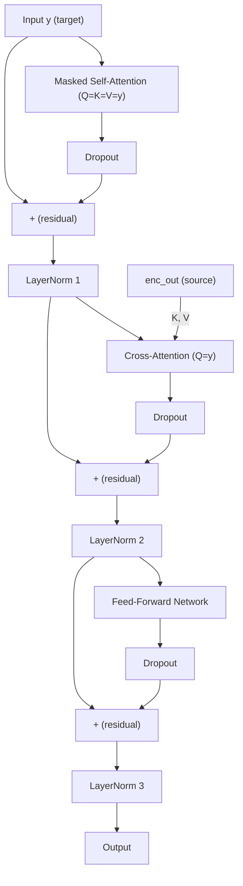

This post dissects every component of the Transformer (Vaswani et al., 2017) by mapping the math from Andrew Ng's Course 5 Week 4 directly to a from-scratch PyTorch implementation. Concrete tensor dimensions are traced through each layer so that the reader always knows exactly what shape enters and exits every operation.

Running example dimensions throughout: $\text{batch} = 2$, $\text{num\_heads} = 4$, $d\_{\text{model}} = 128$ (so $d\_k = d\_v = 32$ per head), source length $T\_q = 5$, key/value length $T\_k = 7$.

---

## 1. Scaled Dot-Product Attention

The atomic building block of the entire architecture:

$$\text{Attention}(Q, K, V) = \text{softmax}\Bigl(\frac{Q K^\top}{\sqrt{d\_k}}\Bigr) V$$

### 1.1 Computing Scores

With $Q \in [2, 4, 5, 32]$ and $K \in [2, 4, 7, 32]$, the transpose `K.transpose(-2, -1)` flips the last two axes:

$$K^\top \in [2, 4, 32, 7]$$

The batched matrix multiply `Q @ K.transpose(-2, -1)` treats the first two dimensions as parallel batch indices and multiplies only the last two:

$$[2, 4, 5, 32] \times [2, 4, 32, 7] \to [2, 4, 5, 7]$$

Each head now holds a $5 \times 7$ table of raw similarity scores between every query position and every key position.

### 1.2 Why Divide by $\sqrt{d\_k}$

If the entries of $Q$ and $K$ are i.i.d. with zero mean and unit variance, the dot product of two $d\_k$-dimensional vectors has variance $d\_k$. As $d\_k$ grows, the dot products become large, pushing softmax into regions with near-zero gradients. Dividing by $\sqrt{d\_k}$ rescales the variance back to 1 and keeps training stable.

### 1.3 Masking

```python
scores.masked_fill_(~mask, -float('inf'))
```

Positions where `mask` is `False` are set to $-\infty$. After softmax, $e^{-\infty} = 0$, so those positions receive zero attention weight and are completely ignored in the weighted sum.

### 1.4 Weighted Sum

$$[2, 4, 5, 7] \times [2, 4, 7, 32] \to [2, 4, 5, 32]$$

Each of the 5 query positions now holds a 32-dimensional vector that is the attention-weighted combination of all value vectors.

---

## 2. Multi-Head Attention

### 2.1 Learnable Projections

Four linear layers $W\_Q, W\_K, W\_V, W\_O$ (each $d\_{\text{model}} \to d\_{\text{model}}$, i.e. $128 \to 128$) project the input into query, key, value, and output spaces. These weight matrices are the only trainable parameters; the data tensors $q, k, v$ flowing through them change with every input.

### 2.2 `split_heads` — Carving Out Parallel Heads

Starting from $x \in [B, T, d\_{\text{model}}] = [2, 5, 128]$:

1. `view(B, T, H, d_k)` reshapes to $[2, 5, 4, 32]$ — slicing the 128-dim feature into 4 heads of 32.
2. `transpose(1, 2)` swaps the sequence and head axes, yielding $[2, 4, 5, 32]$.

This layout lets the `@` operator treat the head dimension as a batch dimension, computing all 4 heads in parallel with a single kernel launch.

### 2.3 `combine_heads` — Reassembling

The inverse: `transpose(1, 2)` back to $[2, 5, 4, 32]$, then `reshape` to $[2, 5, 128]$. The code uses `reshape` rather than `view` because the preceding transpose may leave the tensor non-contiguous in memory.

---

## 3. Positional Encoding

### 3.1 The Formula

$$PE\_{\text{pos}, 2i} = \sin\Bigl(\frac{\text{pos}}{10000^{2i / d\_{\text{model}}}}\Bigr), \quad PE\_{\text{pos}, 2i+1} = \cos\Bigl(\frac{\text{pos}}{10000^{2i / d\_{\text{model}}}}\Bigr)$$

Each index $i$ generates a sin/cos pair occupying two adjacent columns (even column $2i$ and odd column $2i+1$). With $d\_{\text{model}} = 128$ there are 64 distinct frequency bands.

### 3.2 Numerically Stable Computation

Computing $10000^{2i/d}$ directly risks overflow. Using the identity $x = e^{\ln x}$:

$$10000^{2i/d} = \exp\Bigl(\frac{2i}{d} \ln 10000\Bigr)$$

The code inverts this into the denominator with a sign flip:

```python
div_term = torch.exp(torch.arange(0, d_model, 2).float() * (-math.log(10000.0) / d_model))
```

Here `arange(0, d_model, 2)` directly generates the sequence $2i = 0, 2, 4, \ldots$, so the formula is evaluated without ever forming the huge base.

### 3.3 Dimensions and Broadcasting

- `position = arange(0, max_len).unsqueeze(1)` has shape $[5000, 1]$ — a column vector of positions.
- `div_term` has shape $[64]$ — a row vector of frequency scales.
- `position * div_term` broadcasts to $[5000, 64]$, which is then split into sin (even columns) and cos (odd columns) to fill a $[5000, 128]$ table.
- A leading batch dimension is added via `unsqueeze(0)` to get $[1, 5000, 128]$, and the table is registered as a non-trainable buffer.

### 3.4 Why Addition Instead of Concatenation

Three reasons justify element-wise addition $x + PE$ over concatenation $[x; PE]$:

1. **Parameter efficiency.** Concatenation would double the input dimension to all downstream weight matrices ($W\_Q, W\_K, W\_V$), roughly quadrupling compute.
2. **Orthogonal subspaces.** In high-dimensional space, random vectors are nearly orthogonal. The network can learn to allocate some dimensions for semantics and others for position, then disentangle them through its linear projections.
3. **Distributes as a position-specific bias.** The very next operation is a linear projection: $W(x + PE) = Wx + W(PE)$. The second term acts as a learned, position-dependent bias vector.

---

## 4. Architecture Overview

### 4.1 Module Hierarchy

The Transformer is a deeply nested, modular design. The ownership tree (what contains what):



### 4.2 EncoderLayer Data Flow

Each `EncoderLayer` applies two sub-operations, each wrapped with a residual connection, dropout, and layer normalization:



In code:

```python
attn_out = self.self_attn(x, x, x, mask)       # Q = K = V = x
x = self.layer_norm1(x + self.dropout1(attn_out))
ffn_out = self.ffn(x)
x = self.layer_norm2(x + self.dropout2(ffn_out))
```

### 4.3 DecoderLayer Data Flow

The decoder layer has three sub-operations. The cross-attention step is the bridge between source and target:



- **Masked self-attention**: Q, K, V all come from the target sequence $y$. A causal mask prevents each position from attending to future positions.
- **Cross-attention**: Q comes from the target; K and V come from the encoder output `enc_out`. This is where the decoder searches the source sentence for translation cues.
- **FFN**: position-wise nonlinear feature deepening.

### 4.4 Layer Stacking with `nn.ModuleList`

```python
self.layers = nn.ModuleList([EncoderLayer(...) for _ in range(num_layers)])
for layer in self.layers:
    x = layer(x, mask)
```

Using `nn.ModuleList` instead of a plain Python list is essential: PyTorch's `nn.Module` base class only tracks sub-modules registered through its attribute system. A plain list would make the layer weights invisible to `model.parameters()` (breaking training) and to `model.to("cuda")` (causing device mismatch errors).

---

## 5. Three Attention Scenarios Compared

The same `MultiHeadAttention` class is instantiated three times with different Q/K/V sources:

| Scenario | Q source | K, V source | Scores shape | Purpose |
|---|---|---|---|---|
| Encoder self-attention | Encoder input $x$ $[2,4,7,32]$ | Same $x$ $[2,4,7,32]$ | $[2,4,7,7]$ | Each source token attends to all other source tokens, building global context. |
| Decoder masked self-attn | Decoder input $y$ $[2,4,5,32]$ | Same $y$ $[2,4,5,32]$ | $[2,4,5,5]$ | Each target token attends only to itself and earlier tokens (causal mask). |
| Decoder cross-attention | Decoder features $[2,4,5,32]$ | Encoder output `enc_out` $[2,4,7,32]$ | $[2,4,5,7]$ | Each of the 5 target tokens searches across all 7 source tokens for translation cues. |

Note the cross-attention score shape $[2,4,5,7]$: rows are determined by the query count (target length), columns by the key count (source length). Even when source and target have very different lengths, the matrix multiply naturally bridges the two feature spaces.

---

## 6. End-to-End Dimension Trace

Using $T\_{src} = 7$, $T\_{tgt} = 5$, vocab size $= 10000$:

**Phase 1 — Encoder (source side)**

| Step | Operation | Shape |
|---|---|---|
| Input | Source token indices | $[2, 7]$ |
| Embedding | `nn.Embedding(10000, 128)` | $[2, 7, 128]$ |
| Scale | Multiply by $\sqrt{128}$ | $[2, 7, 128]$ |
| Positional encoding | Add $[1, 7, 128]$ (broadcast) | $[2, 7, 128]$ |
| N x EncoderLayer | Self-attention + FFN | $[2, 7, 128]$ |
| Output | `enc_out` | $[2, 7, 128]$ |

**Phase 2 — Decoder (target side)**

| Step | Operation | Shape |
|---|---|---|
| Input | Target token indices | $[2, 5]$ |
| Embedding + scale + PE | Same pipeline as encoder | $[2, 5, 128]$ |
| N x DecoderLayer | Masked self-attn + cross-attn + FFN | $[2, 5, 128]$ |
| Output | `dec_out` | $[2, 5, 128]$ |

**Phase 3 — Prediction**

| Step | Operation | Shape |
|---|---|---|
| `fc_out` | `nn.Linear(128, 10000)` | $[2, 5, 10000]$ |
| Inference | `argmax(dim=-1)` | $[2, 5]$ |

---

## 7. Masking and Parallel Training

### 7.1 Shifted Target Slicing

Given a target sentence `["Jane", "visits", "Africa", "."]`, the full padded sequence is:

$$\text{tgt} = [\text{sos}, \text{Jane}, \text{visits}, \text{Africa}, \text{.}, \text{eos}, \text{pad}]$$

Training splits this with a one-position offset:

- **Decoder input** `tgt[:, :-1]`: $[\text{sos}, \text{Jane}, \text{visits}, \text{Africa}, \text{.}, \text{eos}]$
- **Ground truth** `tgt[:, 1:]`: $[\text{Jane}, \text{visits}, \text{Africa}, \text{.}, \text{eos}, \text{pad}]$

At each position, the decoder is trained to predict the next token.

### 7.2 Combined Padding + Causal Mask

The final boolean mask `tgt_mask = pad_mask & causal` for a length-7 input:

```
Key positions:  <sos>  Jane  visits  Africa    .   <eos>  <pad>
Row 0 (<sos>):   T      F      F      F       F     F      F    --> predict "Jane"
Row 1 (Jane):    T      T      F      F       F     F      F    --> predict "visits"
Row 2 (visits):  T      T      T      F       F     F      F    --> predict "Africa"
Row 3 (Africa):  T      T      T      T       F     F      F    --> predict "."
Row 4 (.):       T      T      T      T       T     F      F    --> predict "<eos>"
Row 5 (<eos>):   T      T      T      T       T     T      F    --> predict "<pad>"
Row 6 (<pad>):   T      T      T      T       T     T      F    --> (ignored by loss)
```

- The lower-triangular structure is the **causal mask** — no position can attend to the future.
- The rightmost column is all `F` because `<pad>` is masked by the **padding mask**.
- Row 4 is the key learning signal for end-of-sentence: when the model sees `"."`, it must learn to predict `<eos>`.
- The loss function uses `ignore_index=pad_idx`, so rows 5 and 6 contribute zero gradient.

This single 2D mask lets the GPU evaluate all 6 prediction tasks in one parallel forward pass — no sequential loop required as in RNN-based models.

---

## 8. Greedy Decoding at Inference

### 8.1 Autoregressive Growth

At inference time, the decoder generates tokens one at a time in a "snowball" loop:

| Iteration | Decoder input `tgt` | Shape | Predicted token |
|---|---|---|---|
| 0 | $[\text{sos}]$ | $[1, 1]$ | Jane |
| 1 | $[\text{sos}, \text{Jane}]$ | $[1, 2]$ | visits |
| 2 | $[\text{sos}, \text{Jane}, \text{visits}]$ | $[1, 3]$ | Africa |
| 3 | $[\text{sos}, \text{Jane}, \text{visits}, \text{Africa}]$ | $[1, 4]$ | . |
| 4 | $[\text{sos}, \text{Jane}, \text{visits}, \text{Africa}, \text{.}]$ | $[1, 5]$ | eos |

The encoder output `enc_out` is computed once and reused at every iteration.

### 8.2 Stripping `<sos>`

The final return is `tgt[:, 1:]` — dropping the start token to give the user only the generated translation.

### 8.3 Batch Size = 1 Limitation

The current implementation uses `.item()` to check for `<eos>`, which requires a scalar tensor. With `batch > 1`, different sentences finish at different lengths, requiring complex logic to pad finished sequences and mask their attention. Production systems (e.g., Hugging Face `generate`) handle this with beam tracking and state machines, but the single-sentence version keeps the teaching code clean.
